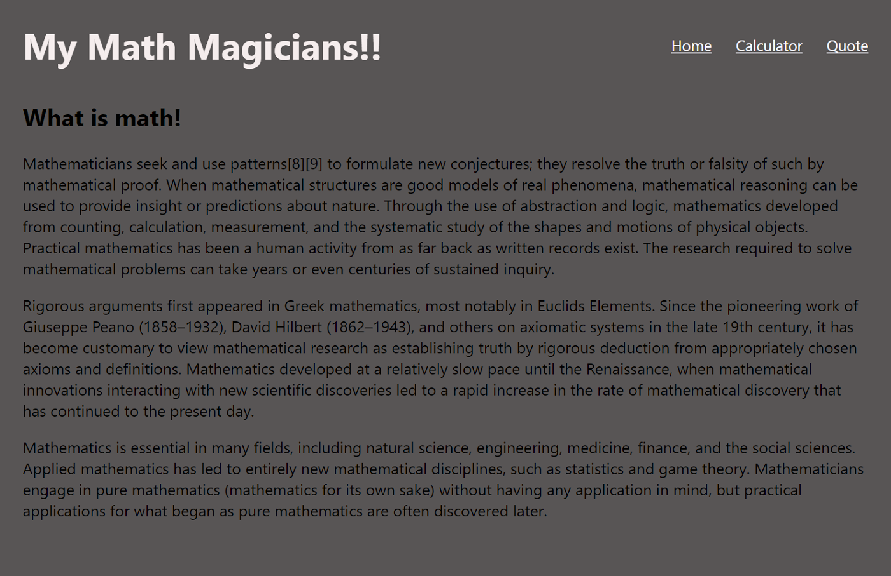
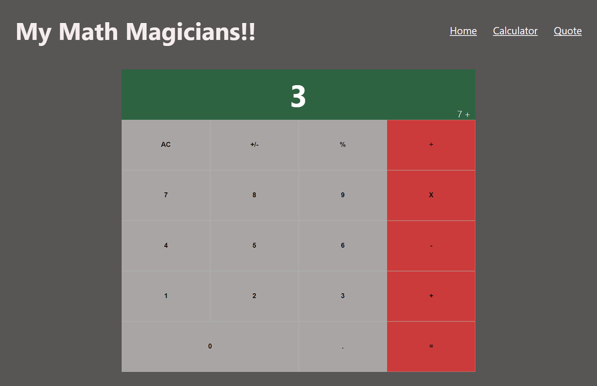
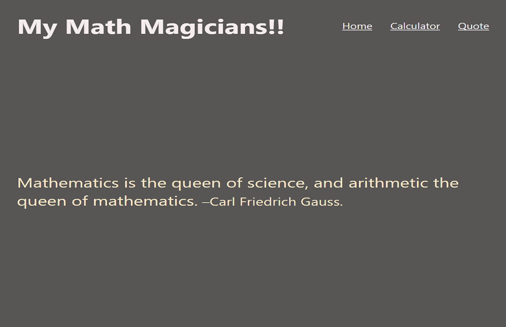

# Math-Magician

This project is a calculator, developed using React.

## `Build-With`

- React
- VScode

## Screen-shots:

## Live-Demo

[Calc-App](https://calc-lamia-sristy.herokuapp.com/)

## Getting Started

### `npm start`

Runs the app in the development mode.\
Open [http://localhost:3000](http://localhost:3000) to view it in the browser.

The page will reload if you make edits.\
You will also see any lint errors in the console.
Launches the test runner in the interactive watch mode.\
See the section about [running tests](https://facebook.github.io/create-react-app/docs/running-tests) for more information.

### `npm run build`

Builds the app for production to the `build` folder.\
It correctly bundles app in production mode and optimizes the build for the best performance.

### `Prerequisites`

To get this project up and running locally, "yarn install" is needed to be run in order to include all dependencies used for this project.

**To get this project set up on your local machine, follow these simple steps:**

1. Open Terminal.
2. Navigate to your desired location to download the contents of this repository.
3. Copy and paste the following code into the Terminal: git clone https://github.com/LamiaSristy/math-magician
4. cd into  math-magician
5. Run "npm install".
6. Run "npm start".
6. Open, in your browser, 'localhost:3000'.

## Author Details::

👤 **Lamia Sristy**

- Github: [@LamiaSristy](https://github.com/LamiaSristy)
- Linkedin: [@LamiaSristy](https://www.linkedin.com/in/lamia-hemayet-sristy/)
- E-mail: <a href="mailto:lamiasristy@gmail.com?subject=Hello Lamia!">Email</a>  
- Twitter: [@LamiaSristy](https://twitter.com/lsristy1)

## Show your support

Give ⭐ Star me on GitHub — it helps!

## 📝 License

This project is [MIT](lic.url) licensed.